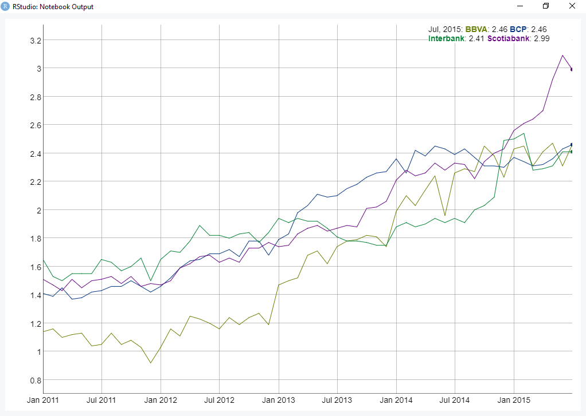

<!-- README.md is generated from README.Rmd. Please edit that file -->

```{r, echo = FALSE}
knitr::opts_chunk$set(
  collapse = TRUE,
  comment = "#>",
  fig.path = "man/figures/"
)
```

# SBSR 

[](https://www.tidyverse.org/lifecycle/#maturing)

SBSR es un paquete disenado para trabajar facilmente con data publica de la SBS, de forma gratuita, libre y facil. Este proyecto 
es creado por [Behavioral Economics & Data Science Team (BEST)](http://besteamperu.org). Aprende a utilizarlo con nuestros ejemplos en <https://bestdatascience.github.io/SBSR/index.html>, <https://bestdatascience.github.io/docs/articles/analisis-4-principales-bancos.html> y
<https://bestdatascience.github.io/SBSR/docs/articles/analisis-banco-ripley-vs-banco-falabella.html>.

## Instalacion

### Instalacion para principiantes
Lo primero que debemos hacer es instalar primero R en este [enlace](https://cran.r-project.org/bin/windows/base/) y luego RStudio en este [enlace](https://download1.rstudio.org/RStudio-1.1.453.exe). Posteriormente dentro de la consola se debera poner los siguientes scripts 

```{r, eval = FALSE}
# Los paquetes nuevos son instalados a traves de la funcion install.packages(), siempre entre comillas

install.packages("ggplot2")
install.packages("dplyr")
install.packages("reshape2")
install.packages("tidyr")
install.packages("xts")
install.packages("zoo")
install.packages("dygraphs")
install.packages("devtools")
install.packages("lubridate")
devtools::install_github("BESTDATASCIENCE/SBSR")

```


### Instalacion para R Users

Instalemos primero los paquetes necesarios de forma inteligente! Usemos la siguiente funcion: copiala y pega en tu consola de R, o ponlo en un script y usa control control + enter.


```{r, eval = FALSE}
#apliquemos funciones para hacer el proceso mas veloz

rpak <- function(pkg){
    new.pkg <- pkg[!(pkg %in% installed.packages()[, "Package"])]
    if (length(new.pkg)) 
        install.packages(new.pkg, dependencies = TRUE)
    sapply(pkg, require, character.only = TRUE)
}

# los paquetes que necesitamos!

packages <- c("ggplot2", "dplyr", "reshape2","tidyr","xts","zoo","dygraphs","devtools","lubridate")
rpak(packages)

# Instala la ultima version de nuestro paquete usando
devtools::install_github("BESTDATASCIENCE/SBSR")

```

## Activacion de paquetes

### Activacion para principiantes
Utilicemos la funcion `library()` para activar los paquetes instalados.

```{r, eval = F,message=FALSE,warning=FALSE,results='asis'}
library(SBSR)
library(xts)
library(dplyr)
library(tidyr)
library(dygraphs)
library(ggplot2)
library(reshape2)
library(lubridate)
```

### Activacion para R Users
Utilicemos funciones para activar una lista de paquetes!

```{r, eval = F,message=FALSE,warning=FALSE,results='asis'}
packs=c("SBSR","xts","dplyr","tidyr","dygraphs","ggplot2","reshape2","lubridate")
invisible(lapply(packs,library,character=T))
```

## A probar el paquete!

El paquete cuenta con data de los bancos y lo puedes usar facilmente utilizando el siguiente script:


```{r, eval = F,message=FALSE,warning=FALSE,results='asis'}
data("bancos")
bd<-bancos %>% filter (Entidad %in% c("BCP","BBVA","Scotiabank","Interbank")) %>% select(Entidad,morosidad,Fecha)

bd<-bd %>%
  spread(Entidad, morosidad)
bd<-xts(bd[,2:5],order.by = as.Date(bd$Fecha))
dygraph(bd)
```




## Codigo de conducta

Por favor considerar que este paquete cuenta con un [Codigo de Conducta del Contribuidor](CODE_OF_CONDUCT.md). Al participar en este proyecto o utilizarlo, se asume que estas de acuerdo con estos terminos.
